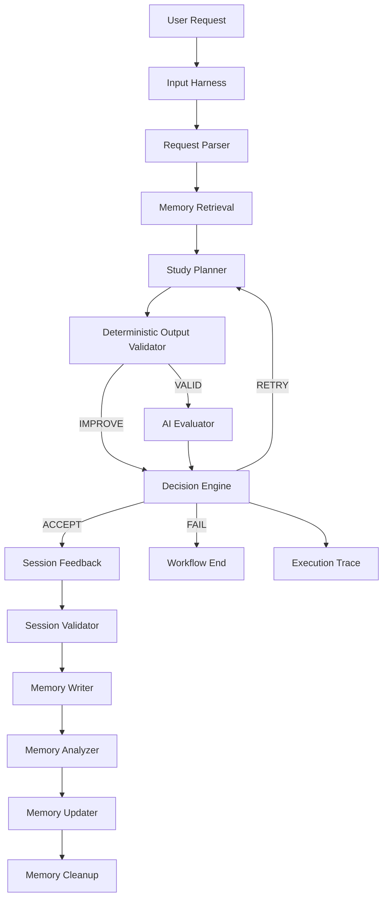

# 🧠 AI Study Planner

> A memory-aware AI study planning system built with LangChain and LangGraph, combining structured LLM outputs, deterministic validation, AI evaluation, retry loops, persistent memory, and execution tracing.

---

## 1. Overview

AI Study Planner converts a student's natural-language study request into a structured, validated study plan.

Example input:

```text
I have 4 hours today. I need to study Python, DSA and LangChain.
Python is more important because I have an interview next week.
```

From this request, the system extracts:

- available study hours
- subjects
- student level
- subject priorities

It then runs a full workflow that:

1. retrieves relevant previous study history
2. retrieves learned memory patterns
3. generates a study plan (Gemini, structured output)
4. validates the plan deterministically
5. evaluates the plan using an LLM
6. decides whether to accept, retry, or fail
7. asks the user for actual session feedback
8. stores the result in persistent memory
9. learns patterns from previous sessions
10. cleans up weak/one-off memory patterns
11. records an execution trace for every attempt

This is **not** a simple:

```text
User → LLM → Answer
```

It is a stateful, multi-step LangGraph workflow:

```text
User
 ↓
Parser
 ↓
Memory Retrieval
 ↓
Planner
 ↓
Deterministic Validation
 ↓
AI Evaluation
 ↓
Decision (ACCEPT / RETRY / FAIL)
 ↓
Session Feedback
 ↓
Memory Update
```

---

## 2. ⭐ What Makes This Project Different?

### 2.1 Structured AI instead of free-form LLM output

The LLM never returns raw text for the application to parse. Every model call is bound to a Pydantic schema via `with_structured_output(...)` (see [llm.py](llm.py)), using these contracts defined in [models.py](models.py):

- `SubjectPriority`
- `UserRequest`
- `StudyItem`
- `StudyPlan`
- `PlanEvaluation`
- `WorkflowError`
- `ExecutionTrace`
- `MemoryUpdate`
- `SessionFeedback`

Structured output makes each step of the workflow inspectable and validatable instead of trusting freeform text.

### 2.2 Deterministic validation + AI evaluation

The project deliberately separates **objective rules** from **subjective quality judgment**.

Deterministic Python ([harness/output_validator.py](harness/output_validator.py)) enforces hard rules:

```text
Are all requested subjects present?
Are there duplicate subjects?
Are there unexpected subjects?
Is total study time within the available hours?
Are study durations positive?
Are priorities valid (High/Medium/Low)?
```

The LLM evaluator ([nodes/evaluator.py](nodes/evaluator.py), using [prompts.py](prompts.py)'s `evaluator_prompt`) handles subjective quality across six scored dimensions:

```text
time_fit_score
subject_coverage_score
priority_alignment_score
level_suitability_score
realism_score
memory_consistency_score
```

> The LLM is not responsible for rules that ordinary deterministic code can enforce reliably.

### 2.3 Loop Engineering

The planner is not one-shot. The core loop, wired in [graph.py](graph.py), is:

```text
Generate → Validate → Evaluate → Decision → Retry if necessary → Generate again
```

[decision.py](decision.py) defines the acceptance thresholds and retry budget:

```python
MAX_ATTEMPTS = 3
MIN_TIME_FIT_SCORE = 7
MIN_SUBJECT_COVERAGE_SCORE = 7
MIN_PRIORITY_ALIGNMENT_SCORE = 7
MIN_LEVEL_SUITABILITY_SCORE = 7
MIN_REALISM_SCORE = 7
MIN_MEMORY_CONSISTENCY_SCORE = 7
```

If any dimension scores below its threshold, the workflow returns `RETRY` with a concrete `retry_reason`, which is fed back into `planner_prompt` on the next attempt so the planner can target the specific weakness instead of regenerating blindly. If `attempt >= MAX_ATTEMPTS`, the workflow returns `FAIL` instead of retrying forever.

### 2.4 Harness Engineering

The LLM is never given unrestricted control over the workflow. Guardrails exist at every boundary:

```text
Input Harness (harness/input_validator.py)
     ↓
Structured Parser (nodes/parser.py)
     ↓
Planner (nodes/planner.py)
     ↓
Output Harness (harness/output_validator.py)
     ↓
AI Evaluator (nodes/evaluator.py)
     ↓
Decision Engine (nodes/decision.py + decision.py)
     ↓
Session Validator (harness/session_validator.py)
```

This includes request-length validation, structured output contracts, deterministic plan validation, AI evaluation, a hard retry limit, structured/recoverable error handling ([error_handler.py](error_handler.py)), and execution tracing ([trace.py](trace.py)).

### 2.5 Persistent Memory

The project remembers previous study sessions in [memory/memory.json](memory/memory.json), managed by [memory/memory_manager.py](memory/memory_manager.py). Each session record stores:

```text
date
subjects
planned_hours
completed_subjects
skipped_subjects
```

The planner receives this history as context (`memory_context`) when generating future plans, e.g.:

```text
Previous history:
DSA has frequently been skipped in previous sessions.

Current request:
I want to study DSA today.

Planner:
Uses that history as supporting context,
but still follows the current request.
```

Guiding principle, enforced in `planner_prompt` and scored by `memory_consistency_score`:

```text
Current User Request  >  Workflow Rules  >  Historical Memory
```

Memory never overrides an explicit current request.

### 2.6 Memory Learning and Consolidation

Memory does not just accumulate raw sessions forever — it is analyzed and consolidated:

- [memory/memory_analyzer.py](memory/memory_analyzer.py) — `analyze_sessions()` scans completed/skipped counts per subject and produces pattern insights (e.g. "X has frequently been skipped").
- [memory/memory_updater.py](memory/memory_updater.py) — `update_learned_patterns()` adds new patterns or increments an existing pattern's `evidence_count`.
- [memory/memory_cleanup.py](memory/memory_cleanup.py) — `cleanup_learned_patterns()` drops patterns with `evidence_count < MIN_EVIDENCE_COUNT` (2) and promotes well-evidenced patterns to `"high"` importance (`evidence_count >= 3`) or `"medium"` otherwise.
- [memory/memory_retriever.py](memory/memory_retriever.py) — `retrieve_learned_patterns()` returns the top patterns sorted by evidence count and importance.

```text
Pattern observed once   → weak, not yet retained
Pattern observed again  → evidence_count increases → retained and eligible for future prompts
```

### 2.7 Execution Trace / Observability

Every attempt is recorded as an `ExecutionTrace` (in [state.py](state.py) → `execution_trace: list[ExecutionTrace]`), built by [trace.py](trace.py)'s `create_execution_trace()` and appended in [nodes/decision.py](nodes/decision.py):

```text
Attempt: 1
Validation: VALID

Time Fit: 9/10
Subject Coverage: 10/10
Priority Alignment: 9/10
Level Suitability: 9/10
Realism: 10/10
Memory Consistency: 8/10

Decision: ACCEPT
```

`main.py`'s `display_execution_trace()` prints the full history at the end of a run, including reason/error fields when a retry or failure occurred — making the workflow inspectable instead of a black box.

---

## 3. Features

- Natural-language study request parsing (Gemini + structured output)
- Structured Pydantic data contracts across the whole pipeline
- LangGraph workflow orchestration with conditional routing
- Input validation (request length checks)
- Deterministic plan validation:
  - subject coverage check
  - duplicate subject detection
  - unexpected subject detection
  - total study-hour validation
  - positive-duration validation
  - priority value validation
- AI plan evaluation across 6 scored dimensions
- Memory-consistency evaluation dimension
- Retry loop with a maximum attempt limit (`MAX_ATTEMPTS = 3`)
- Retry feedback fed back into the planner prompt
- ACCEPT / RETRY / FAIL decision engine
- Structured workflow errors with recoverable/non-recoverable handling
- Persistent JSON memory (`memory/memory.json`)
- Subject-based historical session retrieval
- Learned pattern detection with evidence counts
- Memory cleanup/consolidation of weak patterns
- Interactive session feedback collection (completed/skipped subjects)
- Session feedback validation (no subject both completed and skipped, no unknown subjects)
- Memory update after every completed session
- Full execution tracing across attempts
- Automated tests using `pytest`

---

## 4. 🏗️ Architecture



Conceptual retry loop:

```text
          ┌──────────────┐
          │    Planner   │
          └──────┬───────┘
                 ↓
          ┌──────────────┐
          │  Validator   │
          └──────┬───────┘
                 ↓
          ┌──────────────┐
          │  Evaluator   │
          └──────┬───────┘
                 ↓
          ┌──────────────┐
          │   Decision   │
          └───┬──────┬───┘
              ↓       ↓
           RETRY    ACCEPT
              │       │
              └──→    │
                      ↓
                  Session
                  Feedback
```

This matches the actual graph wiring in [graph.py](graph.py): `retrieve_memory → generate_plan → validate_plan → (evaluate_plan | decision_engine) → decision_engine → (generate_plan | collect_session_feedback | END) → collect_session_feedback → write_session_memory → END`.

---

## 5. Memory Architecture

```text
                    Memory System
                         │
             ┌───────────┴───────────┐
             ↓                       ↓
      Study Sessions         Learned Patterns
             │                       │
             ↓                       ↓
      Subject Retrieval       Evidence Count
                                     │
                                     ↓
                              Memory Cleanup
                                     │
                                     ↓
                              Strong Patterns
```

Memory is currently a **lightweight persistent JSON store** at `memory/memory.json`, containing three top-level keys: `sessions`, `preferences`, and `learned_patterns`. It is loaded/saved via [memory/memory_manager.py](memory/memory_manager.py).

Retrieval is **structured/exact, subject-based matching** (`retrieve_subject_sessions()` in [memory/memory_retriever.py](memory/memory_retriever.py) intersects requested subjects with each session's subject set). This is **not** embedding-based or vector/semantic retrieval.

---

## 6. Project Structure

```text
ai-study-planner/
│
├── main.py                        # CLI entry point, displays results and execution trace
├── graph.py                       # LangGraph StateGraph wiring (nodes, edges, routing)
├── state.py                       # StudyState TypedDict (shared workflow state)
├── models.py                      # Pydantic schemas for all structured data
├── prompts.py                     # ChatPromptTemplate definitions (parser/planner/evaluator)
├── llm.py                         # Gemini model + structured-output bindings
├── decision.py                    # Retry/accept/fail thresholds and decision logic
├── trace.py                       # ExecutionTrace construction helper
├── error_handler.py               # Structured WorkflowError helper
├── pytest.ini                     # pytest configuration
├── requirements.txt               # Python dependencies
├── diagram.png                    # Architecture diagram image
├── .env                           # Local environment variables (not committed)
├── .gitignore
│
├── harness/
│   ├── __init__.py
│   ├── input_validator.py         # Raw user-request length validation
│   ├── output_validator.py        # Deterministic study-plan validation node
│   └── session_validator.py       # Session feedback validation
│
├── nodes/
│   ├── __init__.py                # format_priorities() + node exports
│   ├── parser.py                  # parse_user_request node
│   ├── planner.py                 # generate_plan node
│   ├── evaluator.py               # evaluate_plan node
│   ├── decision.py                # decision_engine node
│   ├── memory.py                  # retrieve_memory node
│   ├── memory_writer.py           # write_session_memory node
│   └── session.py                 # collect_session_feedback node
│
├── memory/
│   ├── __init__.py
│   ├── memory.json                # Persistent JSON memory store
│   ├── memory_manager.py          # load/save memory, save_session_and_learn
│   ├── memory_retriever.py        # subject-based session + pattern retrieval
│   ├── memory_analyzer.py         # derives insights from session history
│   ├── memory_updater.py          # adds/strengthens learned patterns
│   ├── memory_cleanup.py          # removes weak patterns, sets importance
│   └── session_memory.py          # create_session_memory record builder
│
└── tests/
    ├── test_input_validator.py    # harness/input_validator.py
    ├── test_output_validator.py   # harness/output_validator.py
    ├── test_decision.py           # decision.py
    ├── test_trace.py              # trace.py
    └── test_memory_manager.py     # memory/memory_manager.py
```

> `venv/`, `__pycache__/`, and `.pytest_cache/` are excluded above as they are local/build artifacts, not project source.

---

## 7. 🧩 Important Concepts Demonstrated

### LangChain

Used for the Gemini model wrapper (`ChatGoogleGenerativeAI`), prompt templates (`ChatPromptTemplate`), and structured model output (`with_structured_output`).

### LangGraph

Used for the stateful workflow: nodes, edges, conditional routing (`add_conditional_edges`), and the retry loop, compiled as a single `StateGraph` in [graph.py](graph.py).

### Pydantic

Used for every structured contract in the system: parsed requests, plans, evaluations, workflow errors, execution traces, and session feedback — see [models.py](models.py).

### Structured Output

```text
LLM
 ↓
Pydantic schema (with_structured_output)
 ↓
Structured Python object
```

### State Management

`StudyState` ([state.py](state.py)) is a `TypedDict` carrying hours, subjects, level, priorities, memory context, plan, evaluation, decision, retry reason, error, execution trace, session data, and attempt count between all nodes.

### Conditional Edges

`route_after_validation()` routes `validate_plan` to either `evaluate_plan` (if `VALID`) or straight to `decision_engine` (if not). `decision_engine`'s output (`ACCEPT` / `RETRY` / `FAIL`) is routed via a second conditional edge to `collect_session_feedback`, back to `generate_plan`, or to `END`.

### Deterministic Validation

Python enforces the plan's objective structural rules (coverage, duplicates, hour limits, priority values) so the LLM is not trusted to self-police them — see [harness/output_validator.py](harness/output_validator.py).

### LLM-as-Judge / AI Evaluation

`evaluate_plan` asks Gemini to score the plan on 6 dimensions using `evaluator_prompt`, returning a structured `PlanEvaluation`.

### Loop Engineering

`decide_next_action()` / `decide_from_evaluation()` in [decision.py](decision.py) implement the retry budget, per-dimension thresholds, and stopping conditions (`MAX_ATTEMPTS`).

### Harness Engineering

Input validation, output validation, session validation, and structured error handling all act as guardrails around the LLM calls.

### Persistent Memory

JSON-based storage in `memory/memory.json`, read/written through `memory/memory_manager.py`.

### Memory Retrieval

Subject-based matching against past sessions (`retrieve_subject_sessions`), not embeddings.

### Memory Learning

`memory_analyzer.py` extracts patterns (e.g. frequently skipped/completed subjects) from session history.

### Memory Consolidation

`memory_cleanup.py` removes patterns with insufficient evidence and raises importance for well-evidenced ones.

### Error Handling

`error_handler.py`'s `create_workflow_error()` produces a structured `WorkflowError` with a `recoverable` flag that `decision.py` uses to decide between `RETRY` and `FAIL`.

### Observability

`ExecutionTrace` objects accumulate in `state["execution_trace"]` and are printed by `main.py` at the end of every run.

### Testing

Deterministic components (input validation, output validation, decision logic, trace construction, memory manager) are covered by `pytest` tests in `tests/`, since these are the parts of the system that must behave predictably.

---

## 8. Technology Stack

| Technology              | Purpose                                      |
| ------------------------ | --------------------------------------------- |
| Python                   | Core application language                     |
| LangChain / LangChain-Core | LLM integration, prompt templates            |
| langchain-google-genai   | Gemini chat model + structured output binding |
| LangGraph                | Stateful workflow orchestration               |
| Google Gemini            | Request parsing, planning, and evaluation     |
| Pydantic                 | Structured data models and validation         |
| pytest                   | Automated testing                             |
| JSON                     | Persistent memory storage                     |
| python-dotenv             | Loading environment variables from `.env`     |

(Full pinned dependency list is in [requirements.txt](requirements.txt); note `pytest` is used for testing but is not currently pinned there.)

---

## 9. Setup

### Windows (PowerShell)

```powershell
python -m venv venv
.\venv\Scripts\Activate.ps1
pip install -r requirements.txt
pip install pytest
```

### macOS / Linux

```bash
python3 -m venv venv
source venv/bin/activate
pip install -r requirements.txt
pip install pytest
```

### Environment variables

The application calls Google Gemini via `langchain-google-genai`, so a Gemini API key is required. Create a `.env` file in the project root:

```env
GOOGLE_API_KEY=your_api_key_here
```

> Do not commit your real API key. `.env` is already listed in `.gitignore`.

---

## 10. Run the Application

```bash
python main.py
```

Interaction flow:

1. Enter a natural-language study request.
2. The request is parsed into structured hours/subjects/level/priorities.
3. Relevant memory (past sessions + learned patterns) is retrieved.
4. A study plan is generated by Gemini.
5. The plan is deterministically validated.
6. The AI evaluator scores the plan on 6 dimensions.
7. The decision engine accepts, retries, or fails the plan.
8. If accepted, you're asked which subjects you completed/skipped.
9. The session is stored in memory.
10. Learned patterns are updated and weak patterns are cleaned up.
11. The full execution trace is printed.

Example input:

```text
I have 4 hours today. I need to study Python, DSA and LangChain.
Python is more important because I have an interview next week.
```

---

## 11. 🧪 Running Tests

```bash
pytest -q
```

Current test coverage (`tests/`):

- `test_input_validator.py` — request length validation rules
- `test_output_validator.py` — deterministic plan validation (coverage, duplicates, unexpected subjects, hour limits, priority values)
- `test_decision.py` — ACCEPT vs RETRY decision logic from evaluation scores
- `test_trace.py` — execution trace construction from an evaluation
- `test_memory_manager.py` — loading and saving persistent memory

These tests exist and can be run today; exact pass/fail counts depend on your environment (e.g. `memory/memory.json` state) when you run them.

---

## 12. Example Workflow

### Input

```text
I have 4 hours today.
I need to study Python, DSA and LangChain.
Python is more important because I have an interview next week.
```

### Parsed Request (illustrative)

```text
Available hours: 4
Subjects: Python, DSA, LangChain
Level: Beginner

Priorities:
Python: High
DSA: Medium
LangChain: Medium
```

### Example Plan (illustrative — actual LLM output varies)

```text
Python     → 2.0 hours → High
DSA        → 1.0 hour  → Medium
LangChain  → 1.0 hour  → Medium
```

### Example Evaluation (illustrative — not guaranteed)

```text
Time Fit: 10/10
Subject Coverage: 10/10
Priority Alignment: 10/10
Level Suitability: 9/10
Realism: 10/10
Memory Consistency: 9/10
```

---

## 13. Failure Handling

**Invalid input:**

```text
Please enter a study request.
```

**Invalid generated plan (deterministic validation):**

```text
Plan validation failed.
```

Example causes: duplicate subjects, missing/unexpected subjects, total hours exceeding availability, non-positive durations, or invalid priority values.

**AI evaluation / generation failure:** wrapped into a structured `WorkflowError` with `recoverable=True` via `error_handler.create_workflow_error()`, which allows the workflow to `RETRY` (up to `MAX_ATTEMPTS`) instead of crashing.

**Maximum attempts:** once `state["attempt"] >= MAX_ATTEMPTS` (3), the decision engine returns `FAIL` instead of retrying indefinitely, and the graph ends.

---

## 14. 🎯 Design Principles

1. **Current request comes first** — historical memory supports the current request but never overrides it.
2. **Deterministic rules should stay deterministic** — Python enforces objective structural constraints, not the LLM.
3. **LLMs handle subjective reasoning** — the AI evaluator judges plan quality, not structural correctness.
4. **Every retry should have a reason** — `retry_reason` is passed back into the planner prompt.
5. **Never retry forever** — a hard `MAX_ATTEMPTS` limit exists.
6. **Memory should have evidence** — patterns need repeated observation (`evidence_count`) before being trusted.
7. **The workflow should be observable** — every attempt is recorded in `execution_trace`.
8. **AI output should be validated** — structured plan output is always passed through deterministic validation before acceptance.

---

## 15. Learning Progression

This repository doubles as a learning project, evolving in stages:

```text
V1 — Basic AI Study Planner
        ↓
LangChain + Gemini
        ↓
Structured Output
        ↓
LangGraph
        ↓
Validation + Critic
        ↓
V2 — Loop & Harness Engineering
        ↓
Input Harness
        ↓
Output Harness
        ↓
AI Evaluation
        ↓
Decision Engine
        ↓
Retry Loop
        ↓
Error Handling
        ↓
Observability
        ↓
Testing
        ↓
V3 — Memory Engineering
        ↓
Persistent Memory
        ↓
Session Memory
        ↓
Memory Retrieval
        ↓
Memory Analysis
        ↓
Learning Patterns
        ↓
Memory Consolidation
        ↓
Memory + Planning Integration
```

This progression demonstrates how a simple LLM application can evolve into a controlled, stateful AI workflow with reliability guarantees.

---

## 16. 🚧 Future Improvements

- Semantic/vector-based memory retrieval (embeddings)
- Better memory ranking beyond evidence count + importance
- Richer study progress tracking over time
- Calendar integration and reminders
- Web-based UI
- Authentication / multi-user support
- Database-backed memory (instead of a single JSON file)
- LangSmith or similar observability integration
- Structured experiment/evaluation datasets for regression-testing prompts
- Personalized long-term learning analytics

None of the above are currently implemented.

---

## 17. Limitations

- Persistent memory is a single local JSON file (`memory/memory.json`), not a database.
- Memory retrieval is subject-based exact matching, not semantic/embedding-based.
- LLM evaluation is probabilistic — scores and feedback can vary between runs and model versions.
- Generated plans can vary between runs even for the same input.
- Session completion tracking depends entirely on user-provided feedback (self-reported, not verified).
- Memory/pattern quality depends on the volume and quality of recorded session history.
- Workflow accuracy and availability depend on the configured Gemini model and API quota.

---

## 18. Security / Configuration

- API keys belong in `.env` and must never be committed.
- `.env` is already listed in `.gitignore`.
- `memory/memory.json` stores real study session history (subjects, completion/skip data, timestamps) and is **not** currently excluded via `.gitignore` — review its contents before committing or sharing this repository if it contains real personal data.
- Do not commit secrets or personal study data you don't want published.

---

## 19. Summary

AI Study Planner is a practical exploration of reliable AI workflow design. It combines LangChain and LangGraph with structured outputs, deterministic validation, AI evaluation, retry-based loop engineering, harness engineering, persistent memory, memory consolidation, and execution tracing to create a study planner that can learn from previous sessions rather than generating isolated one-off responses.
